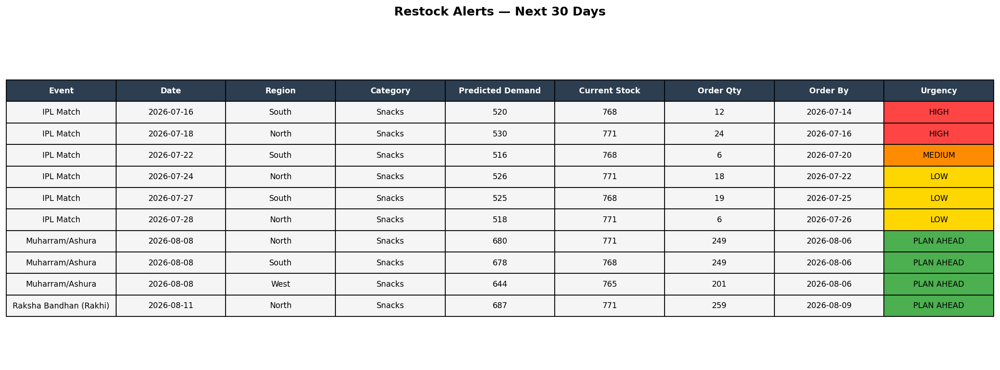
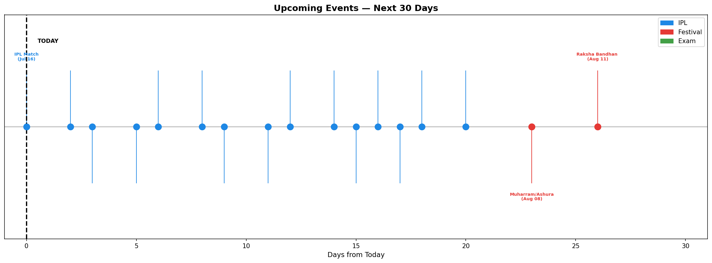
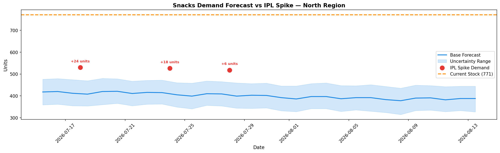
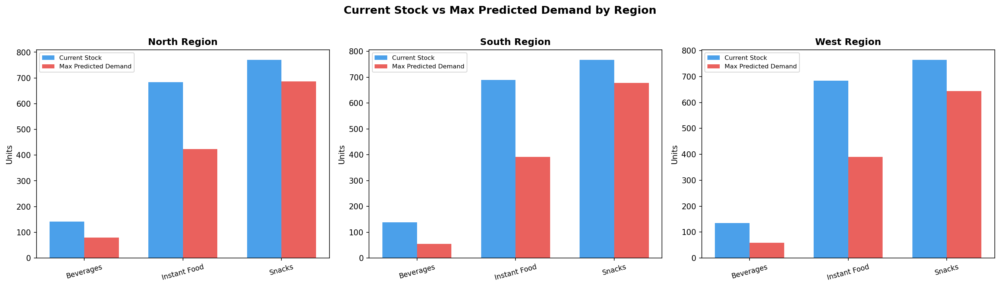

# Festival & Event-Driven Demand Spike Predictor

A demand forecasting system built for quick commerce that predicts inventory spikes during IPL matches, festivals, and local events — and generates automated restock alerts with urgency classification. Built to simulate how platforms like Blinkit and Zepto manage demand volatility around high-traffic events.

---

## Tools & Technologies
- **Python** (pandas, Prophet, matplotlib) — forecasting, alert engine, visualizations
- **Facebook Prophet** — time series demand forecasting with event regressors
- **CSV** — structured restock alert output

---

## Problem Statement
Quick commerce platforms face sudden demand spikes during IPL matches, Diwali, Holi, and regional festivals. Standard inventory models fail to anticipate these surges, leading to stockouts during peak demand windows. This project builds a predictive alert system that identifies upcoming demand spikes and tells operations teams *exactly* what to order and when.

---

## Project Structure

```
festival-demand-predictor/
├── notebooks/
│   └── 01_load_and_clean.ipynb       # Data cleaning, Prophet forecasting, alert engine
├── data/
│   ├── FMCG_2022_2024.csv            # Historical FMCG sales data (Kaggle)
│   ├── festivals_kaggle.csv          # Indian festival calendar dataset (Kaggle)
│   ├── matches.csv                   # IPL match schedule
│   ├── event_master.csv              # Combined event calendar
│   ├── daily_sales.csv               # Processed daily sales by region & category
│   ├── inventory.csv                 # Current inventory levels by region & category
│   └── forecast.csv                  # Prophet forecast output
├── dashboard/
│   └── demand_spike_dashboard.pbix   # Power BI interactive dashboard
├── outputs/
│   ├── restock_alerts.csv            # Generated restock alerts for next 30 days
│   ├── chart1_alerts_table.png       # Restock alerts table with urgency flags
│   ├── chart2_event_timeline.png     # Upcoming events — next 30 days
│   ├── chart3_forecast_vs_spike.png  # Demand forecast vs IPL spike (North Region)
│   └── chart4_stock_gap.png          # Current stock vs max predicted demand by region
└── README.md
```

---

## How It Works

1. **Data Cleaning** — historical sales data cleaned and structured by region and product category
2. **Event Calendar** — IPL matches, festivals (Muharram, Raksha Bandhan, Diwali etc.) loaded as future regressors
3. **Prophet Forecasting** — trained per region × category combination with event impact factors
4. **Spike Detection** — forecasted demand compared against base forecast; spikes flagged automatically
5. **Restock Alert Engine** — generates order quantity, order-by date, and urgency level per event

---

## Key Outputs

### Restock Alerts — Next 30 Days


Urgency classification:
- 🔴 **HIGH** — order immediately (spike within 2 days)
- 🟠 **MEDIUM** — order within 3–5 days
- 🟡 **LOW** — monitor, order within a week
- 🟢 **PLAN AHEAD** — upcoming festival, sufficient lead time

### Upcoming Events Timeline


### Forecast vs IPL Spike (North Region — Snacks)


### Stock Gap Analysis by Region


---

## Key Findings

- **IPL matches drive consistent snack demand spikes** of 25–35% above base forecast across North and South regions
- **Muharram/Ashura** triggers the largest single-event demand surge — 680 units predicted vs ~400 base (70% spike)
- **Raksha Bandhan** drives significant snack and beverage demand in North region
- Current stock levels are **adequate for IPL matches** but will need replenishment for upcoming festivals
- **Beverages are understocked** relative to predicted demand across all 3 regions

---

## Power BI Dashboard
An interactive dashboard built on top of the forecast outputs — visualizing restock alerts, event timelines, stock gap analysis, and demand spikes by region and category.

Open `dashboard/demand_spike_dashboard.pbix` in Power BI Desktop and connect to the CSV files in the `data/` and `outputs/` folders.

---

## Business Impact
- Eliminates reactive restocking — operations teams get alerts **2–7 days before** the spike
- Reduces stockout risk during high-revenue events when demand is hardest to serve
- Order quantity is pre-calculated — no manual estimation needed

---

## How to Run
```bash
pip install pandas prophet matplotlib
jupyter notebook notebooks/01_load_and_clean.ipynb
```

---

## Author
**Sanskriti** | B.Tech Mechanical Engineering, MANIT Bhopal  
Aspiring Data & Business Analyst | Quick Commerce & Demand Forecasting
